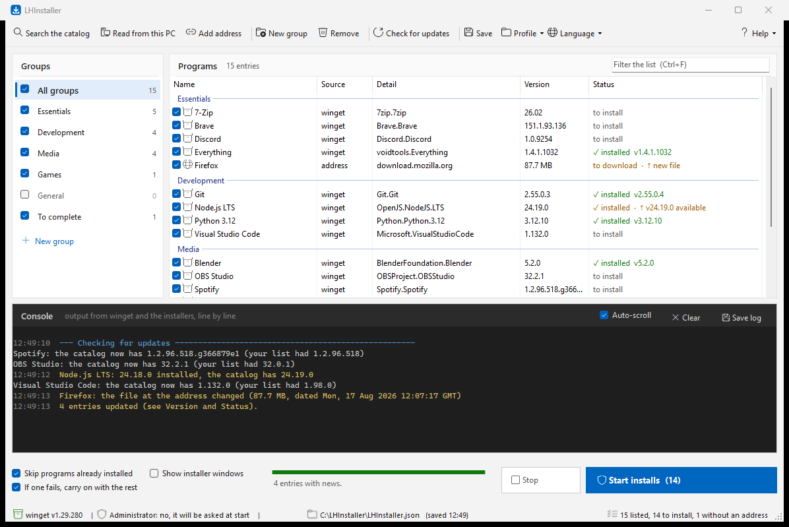

# LHInstaller

**Put the programs of a freshly formatted PC back in place, in two steps.**

A portable Windows app: you build a list of programs *before* you format, copy a
single `.exe` to a USB stick, and afterwards one button downloads and installs
everything again.

It stores no installers of its own — everything is fetched when the time comes, from
the official sources, through **winget**, the Windows package manager.

*Italiano: [README.it.md](README.it.md) · [LEGGIMI.txt](LEGGIMI.txt)*



---

## Why it exists

Reinstalling a PC means remembering what you had, hunting down a dozen download
pages, and clicking Next thirty times. Windows already ships with a package manager
that can do all of that unattended; it just has no memory of *your* list. This is
that memory, plus a button.

## What the target PC needs

Nothing. A clean Windows 10 or 11 already has everything:

| | |
|---|---|
| .NET Framework 4.8 | yes — it is an OS component |
| winget | yes — ships as "App Installer" |
| Python, Node, any runtime | **not needed** |

If winget is missing, LHInstaller says so at startup and disables the button rather
than pretending to work.

## How you use it

**Before formatting**

1. **Read from this PC** — two tabs. The first lists what you have that winget can
   reinstall by itself: tick and done. The second lists what winget *cannot* put
   back (installed from a website, licensed, from a vendor portal). For those you
   can look for a catalog match, paste the installer address, open a web search, or
   file them as reminders.
2. **Search the catalog** — type a name; the row marked *Recommended* is the latest
   stable version, with beta/nightly variants pushed down.
3. **Add address** — for anything the catalog does not carry.
4. Organise into groups, tick what you want, and copy the folder to a USB stick.
   Two files are enough: `LHInstaller.exe` and the `LHInstaller.json` it writes
   next to itself.

**After formatting**

Copy the folder back, double-click, press **Start installs**. One administrator
prompt for the whole session, then it downloads and installs in sequence. The
embedded console streams winget's real output, line by line; the *Status* column
shows where each program is.

## Features

- **winget catalog search** with the main package ranked first, not the beta
- **Reads the current PC** and splits it into *reinstallable* and *not reinstallable*
- **Direct addresses** for anything outside the catalog, with the installer family
  detected from the file's own signature (Inno Setup, NSIS, MSI, WiX, InstallShield)
- **Reminders** for programs you must fetch by hand, so nothing is silently lost
- **Groups** with tri-state checkboxes, instant filter, per-entry install
- **Update check** for both the listed packages and LHInstaller itself
- **Full backup / restore**, and import/export in `winget export` format
- **Italian and English**, switchable from the toolbar
- **Portable**: a single ~230 KB executable, no installation, no dependencies

## What it does not cover

The winget catalog covers what you download from the web: browsers, Discord,
Spotify, VLC, 7-Zip, Steam, Blender, Git, Python, VS Code, OBS and so on.

It does **not** cover software tied to a personal licence or an account — audio
plug-ins, DAWs, video suites and the like. Those appear in the *Not reinstallable*
tab, where you decide for each one: installer address, reminder, or the vendor's
portal as usual.

For direct addresses a silent install is not guaranteed: each installer family takes
a different argument. LHInstaller recognises the common ones from the downloaded
file's signature; when it cannot tell, it opens the installer window and says so in
the console instead of pretending it worked.

## Building it

```powershell
.\build.ps1
```

That is the whole toolchain. It uses `csc.exe` from `C:\Windows\Microsoft.NET`,
present on every Windows 10 and 11 — no Visual Studio, no .NET SDK. The pleasant
consequence: the very PC LHInstaller exists to repopulate can also rebuild it from
source.

The price is that the in-box compiler stops at **C# 5**, and reads files with the
system codepage — so the sources stay **pure ASCII**, with non-ASCII characters
written as `"\uXXXX"`. `build.ps1` refuses to compile if it finds a stray byte,
because the alternative is a binary that is subtly wrong and says nothing.

## Design notes

A few decisions that are not obvious from the code:

**Reading winget's tables without depending on the language.** winget prints
fixed-width tables and translates the headers into the Windows display language.
`Table.cs` derives column positions from the header row and reads values *by
position*, never by name. Every word of the header starts a column: when a column is
as narrow as its own title (`Name Id      Version`) only a single space separates it
from the next, so counting two spaces — as an earlier version did — made the Id
column disappear on small tables.

**Recognising a downloaded installer.** Trying silent flags one after another would
mean running the same installer several times. Instead the first and last 2 MB of the
file are scanned for the family signature, skipping null bytes so UTF-16 strings read
as text too.

**Matching installed programs to the catalog, conservatively.** A first rule ("the
name starts with…") was wrong once in every two matches on a real machine — *DaVinci
Resolve* matched a third-party *DaVinci Resolve RPC* plug-in. The rule now requires an
exact normalised-name match and separates **sure** matches (the publisher in the
identifier appears in the name) from **maybe** ones, shown in orange for a human to
judge. Fewer results, no wrong ones.

**Two languages without a key table.** Italian and English sit next to each other at
the point of use — `Tr.T("Salva", "Save")` — rather than in a separate dictionary.
It costs a few characters per line and removes the classic failure of these setups: a
key changed on one side and stale on the other. What ends up *in the profile* is never
translated: group names are stored in Italian and translated only when displayed, so a
profile built in English still opens in Italian.

**Versions compared numerically.** `1.10` is newer than `1.9`; non-numeric segments
that differ (`g366879e1`) trigger nothing at all, because guessing there would be
worse than staying quiet.

## Licence

MIT — see [LICENSE](LICENSE).
